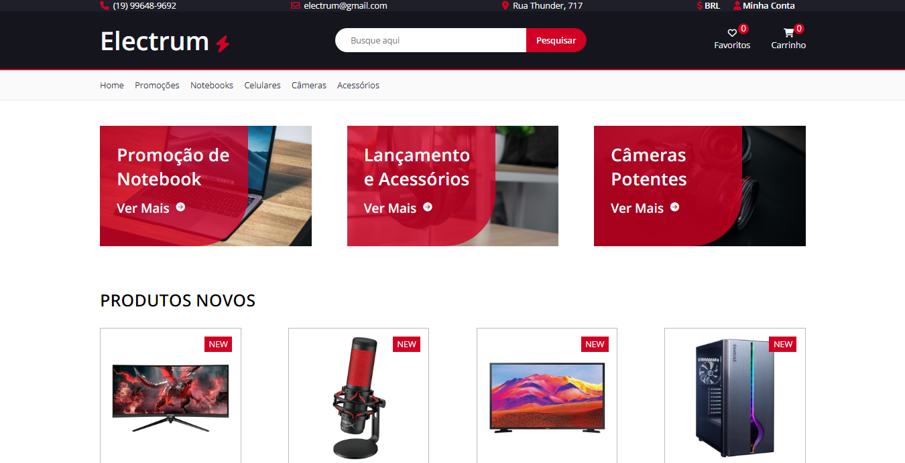

  

<h1 align="center">
    Electrum
</h1>

<h3 align="center">
  Electrum um E-commerce de produtos eletronicos
</h3>

    <a href="#🔗-clique-aqui-para-vizualizar-a-página!">Demonstração</a>&nbsp;&nbsp;&nbsp;|&nbsp;&nbsp;&nbsp;
    <a href="#🔨-tecnologias-usadas">Tecnologias usadas</a>&nbsp;&nbsp;&nbsp;|&nbsp;&nbsp;&nbsp;
    <a href="#🎯-features">Features</a>&nbsp;&nbsp;&nbsp;|&nbsp;&nbsp;&nbsp;
    <a href="#📝-licença">Licença</a>

 

### [🔗 Clique aqui para vizualizar a página!](https://mateuss18.github.io/Electrum/)

  

 

https://user-images.githubusercontent.com/71786964/220215451-8dafc147-f0b6-4a77-ad6f-9a90fc4f0fa7.mp4

>
---

## 🔨 Tecnologias usadas

###

>
---
## 🎯 Features

- Reponsividade 
- Arquitetura SMACSS

---

## 📝 Licença   

Esse projeto está sob a licença MIT. Veja o arquivo [LICENSE](LICENSE) para mais detalhes.

---

Feito por Mateus Lopes :D ❤   

